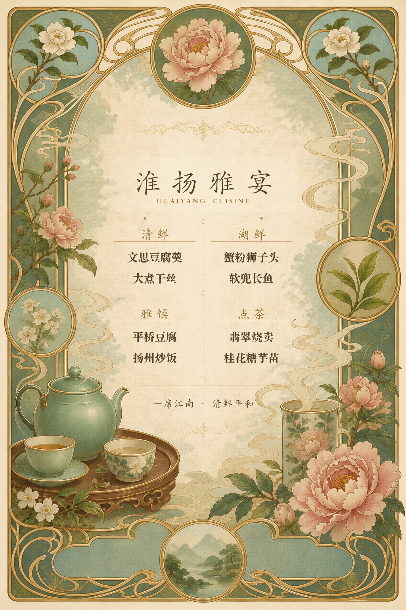

# Mucha Image Studio

**Languages:** English | [简体中文](README.zh-CN.md)

**Repository:** [All skills](../../README.md) | [全部技能（中文）](../../README.zh-CN.md)

**Turn an idea—or a beloved photo—into a graceful Art Nouveau artwork inspired by Alphonse Mucha.**

`mucha-gpt-image-studio` is an Agent Skill for creating polished artwork:
floral profile portraits, pet posters, invitation art, menu frames, social
backgrounds, wallpapers, and other decorative visuals. Its main job is art
direction. It can execute through an agent's native image tool or through
OOMOL's resumable GPT Image 2 workflow.

## See the visual directions

These four generated examples show the kinds of finished artwork this skill is
designed to make. They are representative creative directions, not source
templates: users can substitute their own subject, palette, copy, or reference
photo while keeping the same Art Nouveau art direction.

<table>
  <tr>
    <td width="50%" align="center">
      <a href="examples/mucha-corgi-poster.png"></a><br>
      <strong>Floral corgi poster</strong>
    </td>
    <td width="50%" align="center">
      <a href="examples/mucha-jiangnan-portrait.png"></a><br>
      <strong>Jiangnan portrait</strong>
    </td>
  </tr>
  <tr>
    <td width="50%" align="center">
      <a href="examples/mucha-huaiyang-menu.png"></a><br>
      <strong>Huaiyang cuisine menu</strong>
    </td>
    <td width="50%" align="center">
      <a href="examples/mucha-huizhou-architecture.png"></a><br>
      <strong>Huizhou architecture</strong>
    </td>
  </tr>
</table>

## What it does

### 1. Creates original Art Nouveau images from a written brief

Describe a subject, use case, mood, and palette. The skill chooses a suitable
canvas and applies a Mucha-inspired visual language: flowing linework,
botanical halos, decorative frames, textured print paper, and balanced
editorial composition.

### 2. Turns a supplied photo into a Mucha-inspired artwork

Provide a person, pet, object, or product photo and the skill switches to
reference-guided editing. The source image is placed first and the prompt makes
the preservation requirements explicit—for example a dog's coat markings,
ears, proportions, and expression—while changing the setting, palette,
ornament, and illustration style.

This is an artistic transformation, not a promise of exact identity,
measurement, fit, or print reproduction.

### 3. Adapts composition to the final use

| Need | Default delivery |
| --- | --- |
| Avatar or profile portrait | `1024x1024`, clean crop margins and a floral halo |
| Poster, menu, or invitation | `1024x1536`, ornamental frame and a text-safe zone |
| Moments/WeChat background or social banner | `1536x1024`, intentional quiet space for UI or copy |
| Phone wallpaper | `1024x1536`, tall composition with safe lower margins |

The skill uses named creative directions such as `mucha-pet-poster`,
`mucha-profile-portrait`, `mucha-menu-frame`, `mucha-event-poster`,
`mucha-social-background`, and `mucha-seasonal-card` so each output is composed
for its job rather than using one generic “Mucha style” prompt.

### 4. Uses the image runtime already available

If OOMOL is installed, the skill uses the resumable GPT Image 2 runner. If it
is not installed but the agent already has a native image generation or editing
tool, it uses that tool directly and does not add an unnecessary dependency.
Only an environment with neither capability needs guided OOMOL setup.

## Execution paths

- **OOMOL available:** use the authenticated `oo` CLI and the `gpt-image-2`
  companion for upload, generation, polling, recovery, and download.
- **OOMOL absent, native image tool available:** generate or edit through the
  host tool without installing OOMOL.
- **Neither available:** the agent explains the missing capability and offers
  the official OOMOL setup while retaining the original creative brief.

No API key should be copied into the skill or committed to a repository.

## Add it to your agent

Copy this request to your agent:

```text
Install the mucha-gpt-image-studio skill from https://github.com/alwaysmavs/agent-skills into my active skills directory. Follow SKILL.md and choose the available runtime: use OOMOL when it is already installed, otherwise use the agent's native image tool when possible, and guide OOMOL setup only if neither is available. Preserve a supplied person or pet photo, apply the Mucha-specific art direction, and show me the final image rather than only a local path.
```

The agent-facing runtime instructions, source-image handling, session recovery,
delivery checks, and failure guidance are in [SKILL.md](SKILL.md).

## Design and delivery notes

- Keep generated poster or menu text short. Proofread every rendered word.
  For commercial, legal, multilingual, or exact copy, create a text-safe art
  layer first and typeset final text in a design tool.
- For a multi-asset collection, create a focused job per purpose—such as a
  poster, background, and avatar—not one batch of near-identical variations.
- Generated images are saved with deterministic descriptive names, then
  previewed or attached for the user. Transparent outputs should be verified as
  PNGs with alpha when transparency was requested.
