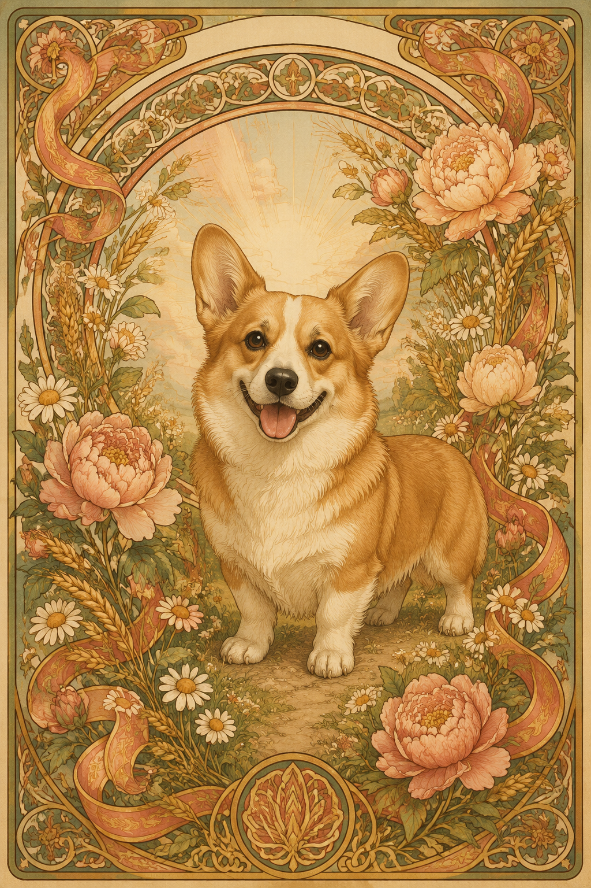
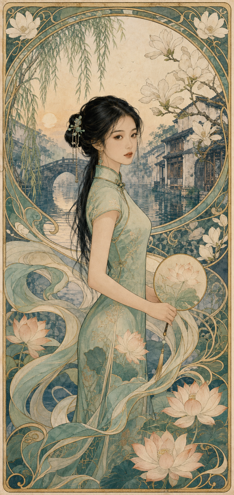
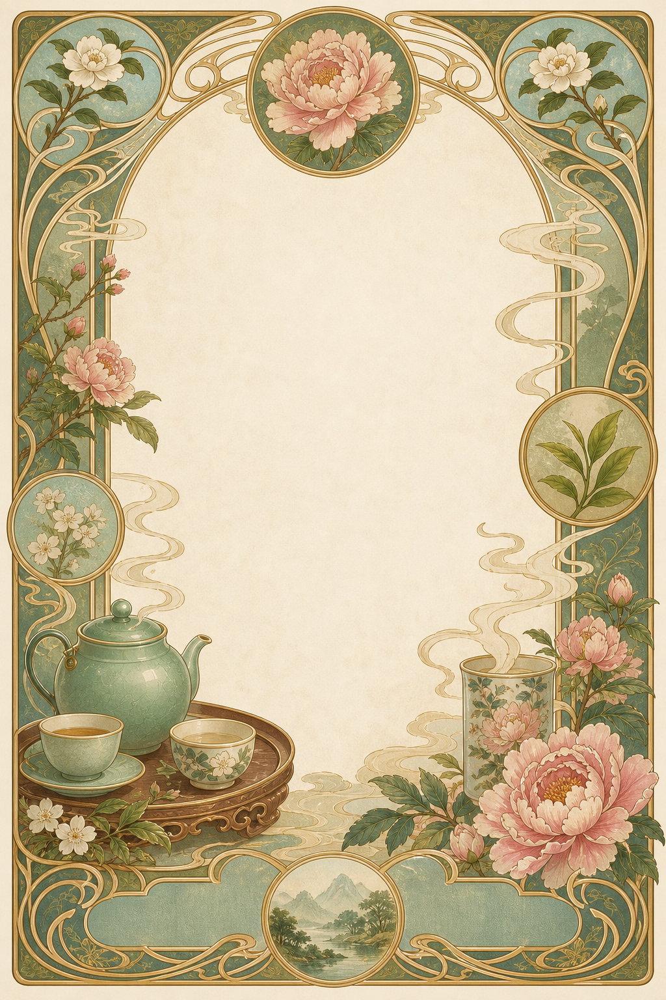
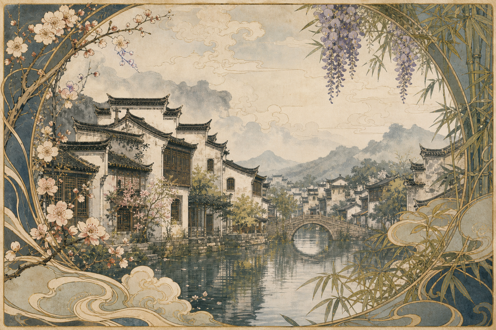

# 穆夏风格图片工作室

**语言：** [English](README.md) | 简体中文

**仓库导航：** [全部技能（English）](../../README.md) | [全部技能（中文）](../../README.zh-CN.md)

**把一个创意，或一张珍爱的照片，变成具有阿尔丰斯·穆夏灵感的新艺术风格作品。**

`mucha-gpt-image-studio` 是一个 Agent Skill，用 GPT Image 2 生成精致的穆夏风头像、宠物海报、邀请函插画、菜单装饰框、朋友圈背景图、壁纸和其他装饰性图片。它负责审美与构图决策，并将生成、改图、上传、恢复任务和下载成品交给配套的 `gpt-image-2` Skill。

## 看看实际效果

以下四张为该 Skill 生成的典型成品，用于让用户在使用前快速判断它适合的视觉方向。它们不是只能复用的固定模板：用户可以替换主体、配色、文案或参考照片，同时沿用穆夏式的新艺术风格方向。

<table>
  <tr>
    <td width="50%" align="center">
      <a href="examples/mucha-corgi-poster.png"></a><br>
      <strong>花卉小柯基海报</strong>
    </td>
    <td width="50%" align="center">
      <a href="examples/mucha-jiangnan-portrait.png"></a><br>
      <strong>江南婉约人物肖像</strong>
    </td>
  </tr>
  <tr>
    <td width="50%" align="center">
      <a href="examples/mucha-tea-menu-frame.png"></a><br>
      <strong>茶菜单装饰框</strong>
    </td>
    <td width="50%" align="center">
      <a href="examples/mucha-huizhou-architecture.png"></a><br>
      <strong>徽派建筑风景</strong>
    </td>
  </tr>
</table>

## 能做什么

### 1. 依据文字描述生成原创穆夏风图片

描述主体、用途、情绪和配色即可。Skill 会选择合适画幅，并使用穆夏式的视觉语言：流动线条、花卉光环、装饰边框、印刷纸张质感和具有呼吸感的编辑式构图。

### 2. 将照片转成穆夏风艺术作品

提供人物、宠物、物品或产品照片后，Skill 会自动进入参考图编辑模式。源图永远放在第一张，并在提示词中明确要保留的特征，例如狗狗的毛色、花纹、耳朵、比例和表情；同时改变背景、配色、装饰和插画风格。

这是艺术化转换，不承诺人物身份、尺码、版型或印花细节绝对一致。

### 3. 按最终用途匹配构图

| 需求 | 默认交付 |
| --- | --- |
| 头像或个人肖像 | `1024x1024`，清晰裁切边缘与花卉光环 |
| 海报、菜单或邀请函 | `1024x1536`，装饰框与可放文字的留白区域 |
| 朋友圈背景或社交横幅 | `1536x1024`，预留文案或 UI 空间 |
| 手机壁纸 | `1024x1536`，竖版构图且底部保留安全区域 |

Skill 使用 `mucha-pet-poster`、`mucha-profile-portrait`、`mucha-menu-frame`、`mucha-event-poster`、`mucha-social-background`、`mucha-seasonal-card` 等创作原型，让每种成品都有对应构图，而不是只在提示词后面追加“穆夏风”。

### 4. 交付真正可用的图片文件

配套 runner 会保存可恢复的 session 文件，轮询同一个生成任务，下载成品，并返回本地路径与远端 URL。任务意外中断时，它会恢复已有 session，不会直接再提交一笔重复的付费生成任务。

## 环境要求

- 已认证且可访问 Fusion API 的 [oo CLI](https://oomol.com)。
- 当前 Agent 的 skills 目录中已安装 `gpt-image-2` 配套 Skill；它提供 GPT Image 2 生成与编辑所需的确定性 runner。
- 可访问图片生成和下载服务的网络连接。

不要把 API Key 写入 Skill 或提交到仓库。

## 让 Agent 安装

将以下请求复制给你的 Agent：

```text
请将 https://github.com/alwaysmavs/agent-skills 中的 mucha-gpt-image-studio skill 安装到我当前 Agent 的 skills 目录。同时确认 gpt-image-2 配套 skill 已安装，并检查已认证的 oo CLI 能否访问 Fusion API 图片生成。请遵循 SKILL.md：如果我提供人物或宠物照片，应尽量保留主体特征；图片应保存到与无关仓库分离的位置；最后请展示最终图片，而不是只报一个本地路径。
```

面向 Agent 的运行步骤、参考图处理、任务恢复、交付检查和失败处理请阅读 [SKILL.md](SKILL.md)。

## 设计与交付说明

- 海报和菜单中的生成文字应尽量短，并逐字校对。若是商用、法律、多语言或必须完全正确的文字，请先生成留白的艺术底图，再在设计工具中排最终文字。
- 需要一套素材时，应分别生成海报、背景图和头像等不同用途的图片，而不是用一批相似变体替代。
- 图片会使用稳定、描述性的文件名保存，并预览或附给用户。请求透明背景时，应检查交付文件是否为保留 alpha 通道的 PNG。
